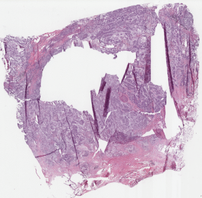

This repository is a software system containing an end-to-end Whole Slide Imaging pre-processing pipeline from 
The Cancer Genome Atlas download documents, as well as a complete implementation 
of deep learning tumor segmentation from WSI binary labels as detailed in 
"Weakly supervised multiple instance learning histopathological tumor segmentation".

[Download 6461 tumor maps from The Cancer Genome Atlas](https://github.com/MarvinLer/tcga_segmentation/releases/download/v1.0.0/thresholded_tumor_maps.zip)

<div align="center">
  
  <p>Example of Whole Slide Image tumor segmentation (black background; blue: normal tissue; pink: neoplastic tissue).</p>
</div>

## Major features
This software is entirely written in Python3 and contains two major parts:
* a tool to automatically download data from [TCGA GDC Data Portal](https://portal.gdc.cancer.gov/),
which also handles tiles extraction, background removal, and tumor label extraction.
* an end-to-end pytorch software that can train many types of common image classifier
architectures for the task of tumor segmentation on WSI based on weak binary WSI 
labels indicating the presence of tumor in each WSI.
* a [collection](results/README.md) of 6481 semi-automatically generated tumor maps for the entire snap-frozen WSI of 
TCGA repository for breast, kidney, and bronchus and lung locations.

## Installation

Use python3 and install mandatory libraries:
```
virtualenv -p python3 --system-site-packages venv
source venv/bin/activate
pip install -r requirements.txt 
```

## Quick Start

### Downloading TCGA cohorts + WSI pre-processing

0. Download the [GDC Data Transfer Tool](https://gdc.cancer.gov/access-data/gdc-data-transfer-tool) executable (not included here for license issues)
1. Constitute any cohort on the [TCGA GDC Data Portal](https://portal.gdc.cancer.gov/), then download
the associated manifest file, and place it in a `source_folder`
2. Launch the download and pre-processing pipeline with:
<pre>
python -m code.data_processing.main --gdc <i>gdc_executable_path</i> source_folder
</pre>

This script first downloads all files in the manifest file, then tiles WSI, extracts tiles of a given magnification, 
removes background tiles, and finally seeks to extract per-slide binary labels from their name. More information 
[here _(in construction)_](code/data_processing/README.md).

### Training WSI segmentation models

After data download and pre-processing has been performed, launch the training pipeline using:
```
python -m code.training --preprocessed-data-folder ./data/preprocessed --alpha 0.1 --beta 0. --max-bag-size 100
```

Many parameters are tunable, see `python -m code.training --help`

More informations about the training pipeline, including available imaging models 
[here _(in construction)_](code/README.md).

## License

This software is released under the 
[GNU Affero General Public License v3.0 license](LICENSE).

## Citation

If you use this software or any part of this software in your research, 
please use the following BibTeX entry.

```BibTeX
@inproceedings{lerousseau2020weakly,
  title={Weakly supervised multiple instance learning histopathological tumor segmentation},
  author={Lerousseau, Marvin and Vakalopoulou, Maria and Classe, Marion and Adam, Julien and Battistella, Enzo and Carr{\'e}, Alexandre and Estienne, Th{\'e}o and Henry, Th{\'e}ophraste and Deutsch, Eric and Paragios, Nikos},
  booktitle={International Conference on Medical Image Computing and Computer-Assisted Intervention},
  pages={470--479},
  year={2020},
  organization={Springer}
}
```

or

> Lerousseau M, Vakalopoulou M, Classe M, Adam J, Battistella E, Carré A, Estienne T, Henry T, Deutsch E, Paragios N. Weakly supervised multiple instance learning histopathological tumor segmentation. InInternational Conference on Medical Image Computing and Computer-Assisted Intervention 2020 Oct 4 (pp. 470-479). Springer, Cham.
